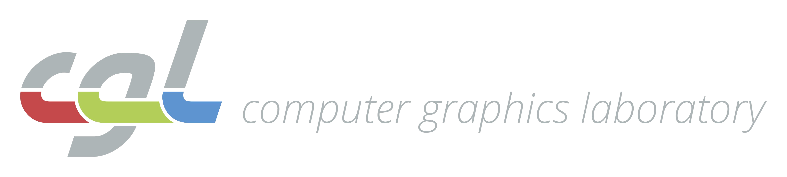
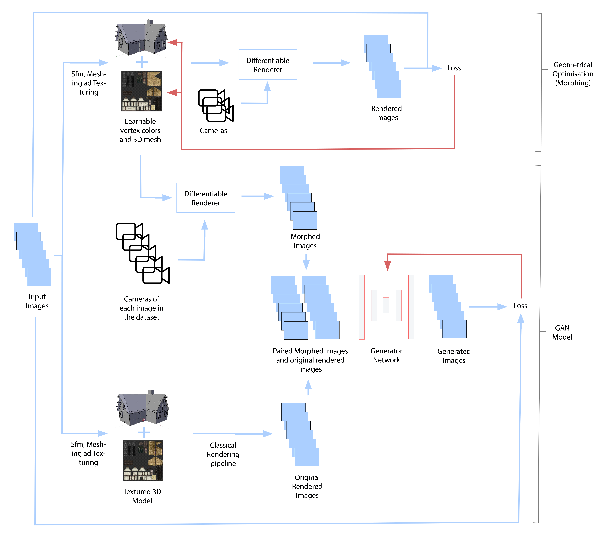
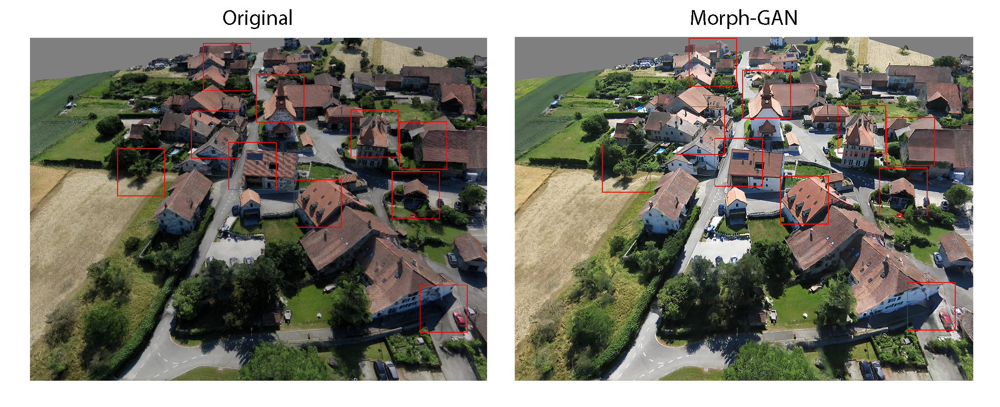
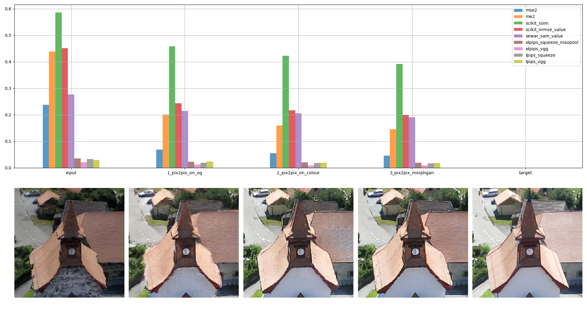
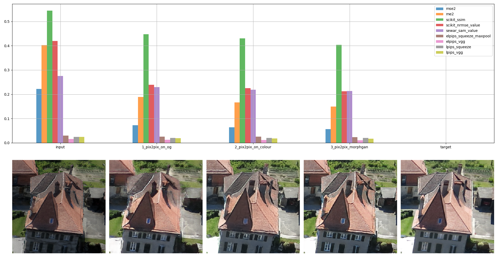
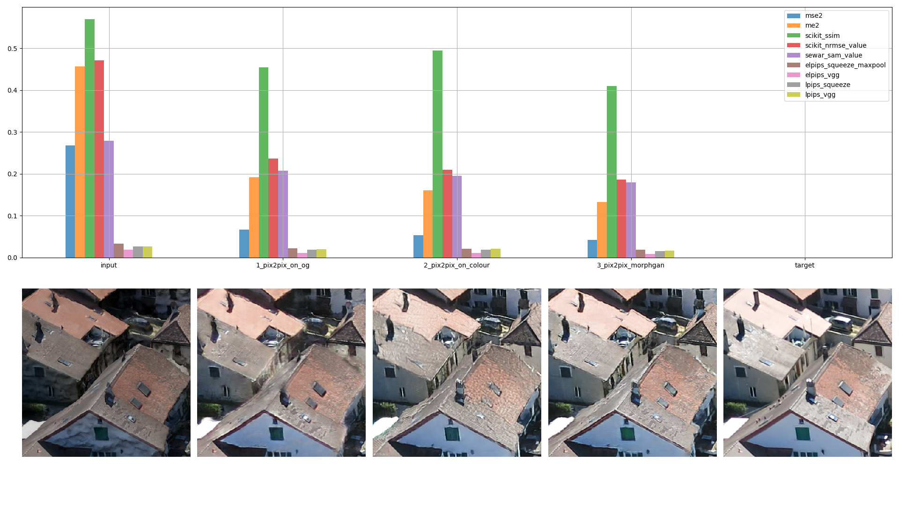

 <p align="center"> </p> 

# REALDIBS: REndering Alternative Deep Image-based Sanssouci


Estimating 3D reconstructions from a collection of images is crucial for a vast variety of applications and thus has received a large amount of attention in recent years. Although classical methods exist which can produce fairly high quality 3D reconstructions, images directly rendered from this representation typically still suffer from a variety of visual artifacts.
In this thesis, we build upon new advances in neural networks and differentiable rendering to synthesize novel views based on an initial 3D reconstruction and the original input views. More specifically, we explore the value of Generative Adversarial Networks for our application and analyze the potential of neural rendering, per vertex geometric optimisation, and Geometric Deep Learning.
Based on the insights from these explorations, we finally propose a novel hybrid method called **Morph-GAN** that combines advantages through per vertex geometry refinement with the texture generation capabilities of GAN models within a differentiable rendering framework.
Our experiments show that the proposed model is capable of significantly improving image quality and the overall realism of generated images.

#
## Table of Contents
1. [Details](#details)
2. [Pipeline](#pipeline)
3. [Results](#results)
4. [Analysis](#analysis)
5. [Instructions](#instructions)

## Details

In this work we address the problem of Total Scene Capture and Image Based Rendering (IBR). The general problem can be described as obtaining a realistic and detailed total scene reconstruction given a deterministic set of images.

All theroetical details and methematical derivations can be forund in the [[Project Report](assets/REAL_DIBS_compressed.pdf)].


## Pipeline

We propose the following two stage pipeline. For more extensive details please refer to the [Project Report](assets/REAL_DIBS_compressed.pdf).

1. **Mesh Optimisation**: We firstly perform per vertex optimisation or "morphing" over the scene's vertices locations and colors. This optimisation performs geometrical refinements over the original scene mesh and is aimed at fixing issues derived from the Structure-from-Motion reconstruction.
We progressively morph the original mesh optimising over a loss between the rendered and the target images, updating gradually the vertices positions and colors. Once convergence is reached, we stop the morphing procedure. 
The code relative to this section can be found in ```meshoptim-morphgan```.

2. **Image-to-Image Translation**: Secondly, after renderering the novel views from the refined geometry, we can train a Pix2pix GAN model over the original recontruction images and the novel refined renderings. The GAN model exibits great capabilities of texture refinement and is in fact able to reconstruct the deisred texture over the rendered images.
The code relative to this section can be found in ```realdibs-gan```.

Here can find see an illustration of the described **Morph-GAN** pipeline.

<p align="center"> </p> 


## Results

Here is a showcase of the image reconstruction capabilities of **Morph-GAN**.
<p align="center"> </p> 


## Analysis

We show more proof of improvement by performing metric analysis over some critical image patches.

<p align="center"> </p> 


We perform our analysis with respect to the following popular metrics:
- MSE: Mean Squared Error.
- ME: Mean Error.
- SSIM: Structural Similarity Index (shown as 1-SSIM)
- NRMSE: Normalised Root Mean Squared Error.
- SAM: Spectral Angle Mapper.
- E-LPIPS: Robust Perceptual Image Similarity via Random Transformation Ensembles.

<p align="center">  </p> 
<p align="center"> </p> 
<p align="center"> </p> 


## Instructions

Please follow the instructions of each section of the pipeline. 
The code has to be run sequentially:

1) Mesh Optimisation: follow the instructions in [meshoptim-morphgan](meshoptim-morphgan/README.rst).
2) Image-to-Image Translation: follow the instructions in [realdibs-gan](realdibs-gan/README.rst).