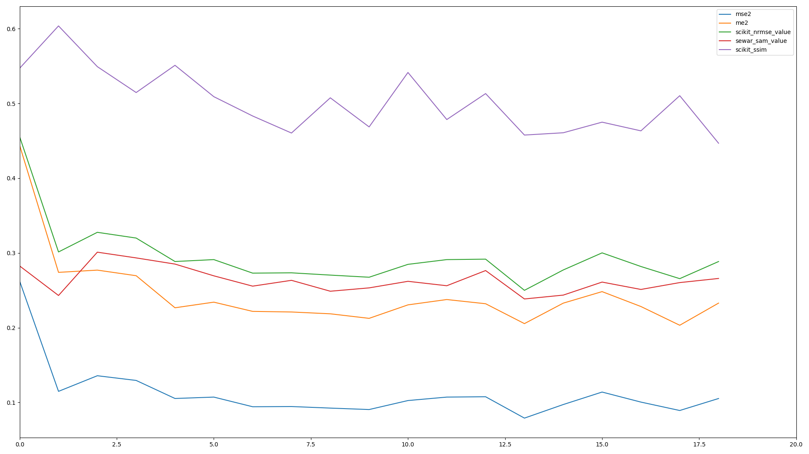
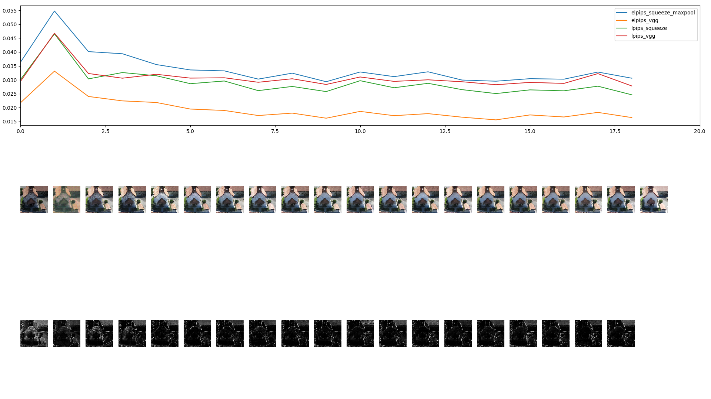

**Image Metrics**

This is a library of image quality metrics to compare two or analyze one image.

The metrics implemented are:

1. def tv_value (image, reference=None):

2. def e2(reference, predicted):

3. def mse2(reference, predicted):

4. def me2(reference, predicted):

5. def scikit_ssim(reference, predicted):

6. def scikit_nrmse_value(reference, predicted):

7. def scikit_psnr_value(reference, predicted):

8. def sewar_ergas_value(reference, predicted):

9. def sewar_sam_value(reference, predicted):

The metrics on the TODO list are:

1. tensorflow ssim_multiscale

2. tensorflow psnr

3. PerceptualSimilarity

4. Netflix/vmaf

5. opencv brisque

6. shiftx

7. reprojection error

8. partialconv

**Modes of Operation**

You can run can:

1. compare 3 images: compare_images(original, rendered, generated, title)

2. compare 2 images: ev, ei = metric(original, generated)

3. process entire folders to compare 2 images

The data structures are currently:

* pb = base path with gt.png and in.png for references

* p = generated path with created images (may also contain in.png for plotting)

* ../errormap/ = will contain the written difference error map per image

* the code internally takes an RGBA rendered in.png and creates an eroded alpha mask.png to ignore

* flag_heavyploy = decides whether to also plot the images onto the graph

* flag_saveerrormap = decides whether to save error difference images

**Examples**

